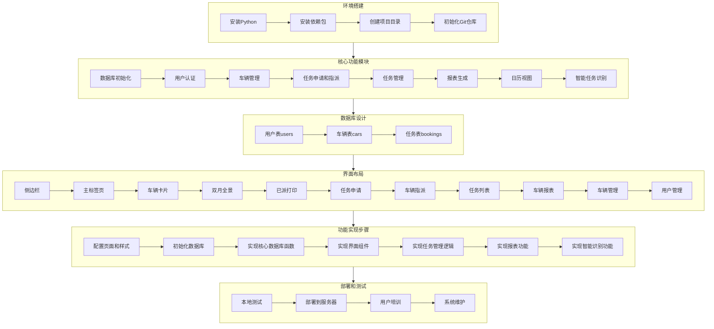

# Yoyo派车车 (CarMgr) 建立指南

## 详细说明

### 1. 环境搭建
- **安装Python**: 确保安装Python 3.7+
- **安装依赖包**: 包括streamlit、pandas、sqlite3、hashlib、re、time、calendar、os、shutil、io、datetime等
- **创建项目目录**: 建立CarMgr文件夹
- **初始化Git仓库**: 用于版本控制

### 2. 核心功能模块
- **数据库初始化**: 创建users、cars、bookings表，设置默认管理员账户
- **用户认证**: 实现登录和权限控制
- **车辆管理**: 添加、编辑、删除车辆信息，设置车辆可用性
- **任务申请和指派**: 提交任务申请，指派车辆
- **任务管理**: 跟踪任务状态，处理逾期任务
- **报表生成**: 生成车辆使用报表，支持导出Excel
- **日历视图**: 双月全景日历，显示车辆使用情况
- **智能任务识别**: 通过正则表达式解析申请文本，自动填充表单

### 3. 数据库设计
- **用户表(users)**: 存储用户名、密码(加密)、角色
- **车辆表(cars)**: 存储车牌号、车型、乘客人数、司机信息、可用性状态
- **任务表(bookings)**: 存储任务信息、车辆分配、状态、里程等

### 4. 界面布局
- **侧边栏**: 显示当前用户、系统状态、快速导航
- **主标签页**: 包含多个功能模块
  - 车辆卡片: 显示车辆状态和任务信息
  - 双月全景: 日历视图显示任务安排
  - 已派打印: 生成和下载任务清单PDF
  - 任务申请: 提交新任务申请
  - 车辆指派: 分配车辆给待指派任务
  - 任务列表: 查看和管理所有任务
  - 车辆报表: 生成车辆使用统计
  - 车辆管理: 添加、编辑、删除车辆
  - 用户管理: 管理系统用户

### 5. 功能实现步骤
1. **配置页面和样式**: 设置Streamlit页面配置，添加自定义CSS
2. **初始化数据库**: 创建表结构，设置默认数据
3. **实现核心数据库函数**: 数据库操作、冲突检查等
4. **实现界面组件**: 标签页、卡片、表单等
5. **实现任务管理逻辑**: 任务申请、指派、状态更新
6. **实现报表功能**: 数据统计、导出Excel
7. **实现智能识别功能**: 文本解析、表单自动填充

### 6. 部署和测试
- **本地测试**: 运行系统，测试各项功能
- **部署到服务器**: 配置服务器环境，部署应用
- **用户培训**: 培训用户使用系统
- **系统维护**: 定期备份数据，更新系统

## 技术栈
- **前端框架**: Streamlit
- **数据处理**: Pandas
- **数据库**: SQLite
- **PDF生成**: ReportLab
- **Excel导出**: openpyxl
- **样式**: 自定义CSS

## 关键功能
1. **智能任务识别**: 通过正则表达式解析申请文本，自动提取日期、时间、人数等信息
2. **任务冲突检查**: 避免车辆在同一时间被多次分配
3. **多维度报表**: 支持按车辆、时间等维度统计使用情况
4. **响应式设计**: 适配不同屏幕尺寸
5. **权限管理**: 区分管理员和普通用户权限
6. **数据导出**: 支持PDF和Excel格式导出

## 扩展建议
1. **添加通知系统**: 任务状态变更时发送通知
2. **集成GPS追踪**: 实时监控车辆位置
3. **添加油耗管理**: 记录和分析车辆油耗
4. **实现移动端适配**: 开发移动应用或响应式网页
5. **集成审批流程**: 增加多级审批功能
6. **添加数据分析**: 提供更详细的车辆使用分析
